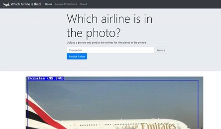
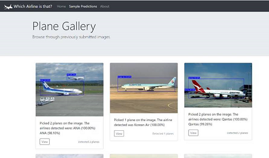
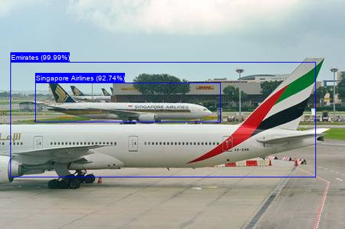
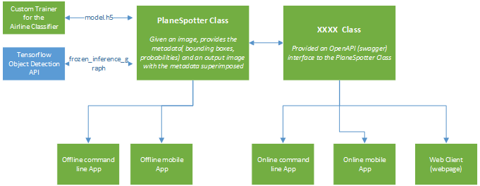

# Plane Spotter
Demo scenario for an App to detect planes in pictures and classify which airline they belong to. For a simple demo version of the web interface, head over [here](http://planespotter-demo.azurewebsites.net). There is also a step by step Jupyter notebook available [here](https://notebooks.azure.com/joaobi/libraries/planespotter/html/3.%20Plane%20Detection%20and%20Classification.ipynb).

 
  


Currently supports:
1. Emirates
2. Singapore Airlines
3. ANA
4. Asiana
5. Korean Airlines
6. Qantas


Key use-case scenarios:
* [Tensorflow Object Detection API](https://github.com/tensorflow/models/tree/master/research/object_detection) - The object (plane) detection API used. Used the standard MSCOCO image library
* Custom airline classifier model built on Keras using the Tensorflow backend - included in code (images not included)

The repo currently includes the code for the web client with additional clients (mobile, offline) to be added at a later time.  


## Overview
This demo includes:
1. apps - TBA
2. libs - shared libs (TF Object Detection API and PlaneSpotter core lib)
3. models - object (plane) detection and airline classification models used by apps and API
4. web_svc - Web Interface and OpenAPI webservice that detect/predicts plane/airline images

## Getting Started

### Prerequisites
```
numpy
pandas
matplotlib
Pillow
flask
tensorflow==1.8.0
```

### Setup
These instructions will get you a copy of the project up and running on your local machine for development and testing purposes. See deployment for notes on how to deploy the project on a live system.

#### Option 1: Docker Image
```
docker run --rm -it planespotter:latest

```

#### Option 2: Deploy Directly
1. Install the pre-requirements from the requirements.txt
2. Run the back-end and/or any client you want

## Authors

* **Joao Bilhim (JB)** - *Initial work*


## License

This project is licensed under the MIT License - see the [LICENSE.md](LICENSE.md) file for details

## Acknowledgments

* Hat tip to anyone whose code was used

